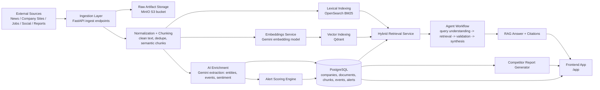
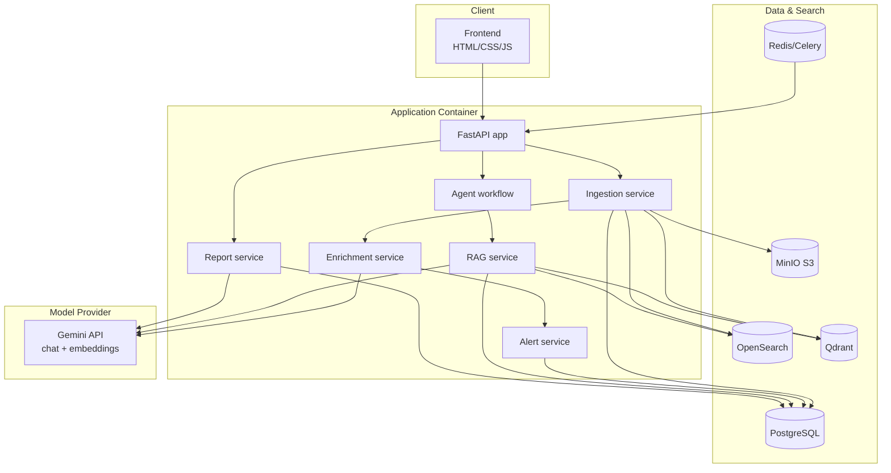

# Market Intelligence AI (End-to-End MVP)

This repository now contains a full software MVP (not just frontend) for market intelligence using:
- FastAPI backend
- PostgreSQL (system of record)
- OpenSearch (BM25 / lexical retrieval)
- Qdrant (vector retrieval)
- MinIO (raw artifact storage)
- Redis + Celery (async task support)
- Gemini API for extraction + answer synthesis
- Agentic workflow for query understanding -> retrieval -> validation -> synthesis

## System Design Architecture

### High-level architecture



ASCII fallback (if Mermaid is not rendered):

```text
[External Sources: News/Company Sites/Jobs/Social/Reports]
                      |
                      v
          [Ingestion Layer: FastAPI endpoints]
               |                    |
               v                    v
      [MinIO Raw Artifacts]   [Normalize + Chunk]
                                     |
                                     +--> [AI Enrichment: Gemini entities/events/sentiment] --> [PostgreSQL]
                                     +--> [Embeddings: Gemini] --> [Qdrant Vector Index]
                                     +--> [BM25 Indexing] --> [OpenSearch]

[OpenSearch] ----\
                  \
[Qdrant] -----------> [Hybrid Retrieval Service] -> [Agent Workflow]
                  /                                (query understanding -> retrieval -> validation -> synthesis)
[PostgreSQL] ----/                                          |
                                                            v
                                                  [RAG Answer + Citations] --> [Frontend /app]

[AI Enrichment] -> [Alert Scoring Engine] -> [PostgreSQL] -> [Frontend /app]
[PostgreSQL] -> [Competitor Report Generator] -> [Frontend /app]
```

### Runtime component view



ASCII fallback (if Mermaid is not rendered):

```text
Client/UI
---------
Frontend (/app)
   |
   v
Application Container
---------------------
FastAPI
  |- Ingestion service
  |- Agent workflow
  |- RAG service
  |- Enrichment service
  |- Alert service
  |- Report service
   |
   +--> PostgreSQL (system of record)
   +--> OpenSearch (BM25)
   +--> Qdrant (vector search)
   +--> MinIO (raw artifacts)
   +--> Redis/Celery (async tasks)
   +--> Gemini API (chat + embeddings)
```

### Request flow (Q&A)
1. User asks question in frontend (`/app`).
2. FastAPI `/api/query/ask` triggers multi-agent workflow.
3. Retrieval agent runs hybrid search:
   - BM25 from OpenSearch
   - Vector similarity from Qdrant
4. Validation agent checks evidence sufficiency/diversity.
5. Synthesis agent calls Gemini with grounded context.
6. API returns answer, confidence, and citations.

### Data ingestion flow
1. Source URL/RSS/report is submitted to ingest APIs.
2. Raw artifact saved to MinIO; metadata saved to Postgres.
3. Text is cleaned, deduplicated, chunked.
4. Chunks indexed in OpenSearch and Qdrant.
5. Enrichment extracts entities/events/sentiment and scores importance.
6. Alerts are created for high-confidence, high-importance events.

## What is implemented

### 1) Ingestion + enrichment pipeline
- URL ingestion (`/api/ingest/url`)
- RSS ingestion (`/api/ingest/rss`)
- Report upload ingestion (`/api/ingest/report`)
- HTML/text extraction and semantic chunking
- Embeddings + Qdrant upsert
- BM25 indexing in OpenSearch
- Event extraction + sentiment + importance scoring
- Alert creation from scored events

### 2) Hybrid RAG + agents
- Hybrid retrieval (OpenSearch + Qdrant score fusion)
- Validation step for evidence sufficiency/diversity
- Grounded synthesis with citation IDs
- API endpoint: `/api/query/ask`

### 3) Intelligence operations
- Watchlist management: `/api/watchlist/companies`
- Events feed: `/api/events`
- Alerts feed + manual evaluation: `/api/alerts`, `/api/alerts/evaluate`
- Competitor report generation: `/api/reports/competitor-summary`

### 4) Product UI
- App UI at `/app`
- Supports watchlist updates, ingestion, query, report generation, events/alerts viewing

## Local run (Docker Compose)

1. Copy env file:

```bash
cp .env.example .env
```

2. Add your Gemini API key in `.env`:

```bash
GEMINI_API_KEY=your_key_here
```

3. Start services:

```bash
docker compose up --build
```

4. Open:
- App: `http://localhost:8000/app`
- API docs: `http://localhost:8000/docs`

## Local run (without Docker)

1. Create venv and install deps:

```bash
cd backend
python3 -m venv .venv
source .venv/bin/activate
pip install -r requirements.txt
```

2. Ensure Postgres / Qdrant / OpenSearch / Redis / MinIO are available and `.env` points to them.

3. Run API:

```bash
uvicorn app.main:app --reload --port 8000
```

## Key endpoints

- `POST /api/ingest/url`
- `POST /api/ingest/rss`
- `POST /api/ingest/report`
- `POST /api/query/ask`
- `POST /api/watchlist/companies`
- `GET /api/watchlist/companies`
- `GET /api/events`
- `GET /api/alerts`
- `POST /api/reports/competitor-summary`

## Current constraints (next improvements)

- Entity linking is heuristic-first (upgrade with a dedicated linker model).
- Reranking is lightweight (upgrade to cross-encoder reranker service).
- File report parser currently handles plain text bytes best (add PDF parser pipeline).
- Alert delivery channel is dashboard-first (add Slack/email connectors).
